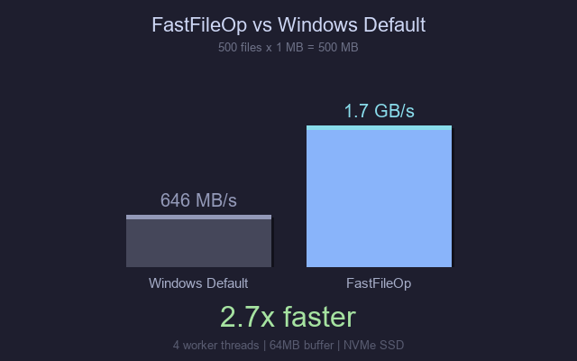

# FastFileOp

> 🇨🇳 **中文用户请点这里**：[中文 README](README_zh.md)

**Windows copy/move/delete accelerator with multi-threaded engine, up to 2.7x faster for multi-file operations.**

[](https://opensource.org/licenses/MIT)
[](https://www.python.org/downloads/)
[](https://www.microsoft.com/windows)

## Features

- 🚀 **High-Speed File Operations** - Multi-threaded engine with CopyFileW API, up to 2.7x faster for multi-file copy
- ⌨️ **Keyboard Hook Integration** - Seamlessly intercepts Ctrl+C/X/V and Delete keys in Explorer
- 🔄 **Shell Extension DLL** - C++ COM component for drag & drop interception
- 📊 **System Tray UI** - Real-time status, pause/resume, settings GUI
- 🔁 **Auto-Start Support** - Automatically launches with Windows
- 🛡️ **Watchdog Mechanism** - Auto-recovery from pipe disconnections
- 🗑️ **Secure Delete** - 3-pass overwrite for permanent deletion
- ⏯️ **Operation Control** - Pause, resume, and cancel ongoing operations
- 🌐 **Bilingual UI** - Chinese / English switchable GUI main window
- 🖥️ **FastCopy-style GUI** - Dedicated operation window with file list & progress

## Architecture

```
┌─────────────────────────────────────────────────────────────────┐
│                    Windows Explorer                              │
│  ┌─────────────┐  ┌─────────────┐  ┌─────────────────────────┐  │
│  │  Ctrl+C/V   │  │   Delete    │  │    Drag & Drop          │  │
│  │   Keys      │  │    Key      │  │                         │  │
│  └──────┬──────┘  └──────┬──────┘  └───────────┬─────────────┘  │
└─────────┼────────────────┼─────────────────────┼────────────────┘
          │                │                     │
          ▼                ▼                     ▼
┌─────────────────────────────────────────────────────────────────┐
│                   FastFileOp Components                          │
│                                                                  │
│  ┌──────────────┐    ┌──────────────┐    ┌──────────────────┐   │
│  │ Keyboard Hook│    │  Shell Ext.  │    │   Clipboard      │   │
│  │  (Python)    │    │  DLL (C++)   │    │   Monitor        │   │
│  └──────┬───────┘    └──────┬───────┘    └────────┬─────────┘   │
│         │                   │                     │             │
│         │                   ▼                     │             │
│         │         ┌──────────────────┐            │             │
│         │         │   Named Pipe     │            │             │
│         │         │ \\.\pipe\FFOPipe │            │             │
│         │         └────────┬─────────┘            │             │
│         │                  │                      │             │
│         ▼                  ▼                      ▼             │
│  ┌─────────────────────────────────────────────────────────┐   │
│  │                    File Engine                           │   │
│  │         (Multi-threaded, 64MB Buffer)                    │   │
│  │  ┌─────────┐  ┌─────────┐  ┌─────────┐  ┌─────────────┐  │   │
│  │  │  Copy   │  │  Move   │  │ Delete  │  │   Secure    │  │   │
│  │  │         │  │         │  │(Recycle)│  │   Delete    │  │   │
│  │  └─────────┘  └─────────┘  └─────────┘  └─────────────┘  │   │
│  └─────────────────────────────────────────────────────────┘   │
│                              │                                  │
│  ┌───────────────────────────┴───────────────────────────┐     │
│  │                   System Tray                          │     │
│  │    Status │ Pause/Resume │ Settings │ Exit            │     │
│  └───────────────────────────────────────────────────────┘     │
└─────────────────────────────────────────────────────────────────┘
```

## Performance Comparison



| Metric | FastFileOp | Windows Default | Improvement |
|--------|------------|-----------------|-------------|
| Multi-File Copy (500x1MB) | **1.7 GB/s** | ~646 MB/s | **2.7x faster** |
| Buffer Size | 64 MB | 8-64 KB | Fewer syscalls |
| Worker Threads | 4 (configurable) | 1 | Parallel I/O |
| Copy API | Windows CopyFileW | Python shutil | Native speed |

### Benchmark Results

```
Test: 500 files x 1MB copy on NVMe SSD (4 worker threads)
FastFileOp:  1.7 GB/s  (multi-threaded, CopyFileW API)
Windows:     646 MB/s  (sequential, shutil.copy2)
Speedup:     2.7x faster

Run benchmark yourself:
  python benchmark.py
```

## Installation

### Quick Start (Recommended)

1. Download `FastFileOp-v1.3.zip` from the [latest release](https://github.com/Liuhaoyu99/FastFileOp/releases/latest)
2. Extract all files to a folder (keep DLL in the same directory as EXE)
3. Run `install.bat` as Administrator to register the Shell Extension DLL
4. Launch `FastFileOp.exe` — it will appear in the system tray

> **Note:** The EXE and DLL must be in the same directory. Do not separate them.

### Auto-Start

FastFileOp uses the **Windows Startup folder** for auto-start (no registry modification):

- Enable auto-start in the tray icon Settings menu
- Or manually create a shortcut to `FastFileOp.exe --silent` in:
  `%APPDATA%\Microsoft\Windows\Start Menu\Programs\Startup`

### Manual Install

```batch
# 1. Build from source (requires Python 3.11+ and MinGW-w64)
build.bat

# 2. Install to Program Files
install.bat

# 3. Register the Shell Extension DLL
C:\Windows\SysWOW64\regsvr32.exe "FastFileOpShim.dll"
```

### Build from Source

```batch
# Build Python executable
pyinstaller --onefile --noconsole --name FastFileOp entry.py

# Build C++ DLL (requires MinGW-w64 32-bit)
cd FastFileOpShim
g++ -shared -o ..\dist\FastFileOpShim.dll -I. -DBUILDING_DLL -DNDEBUG -O2 ^
    -static-libgcc -static-libstdc++ ^
    stdafx.cpp PipeClient.cpp Utils.cpp CopyHook.cpp dllmain.cpp ^
    -lshell32 -lole32 -loleaut32 -luser32 -ladvapi32 -luuid
```

## Uninstallation

```batch
# Run as Administrator
uninstall.bat
```

This will:
- Unregister the Shell Extension DLL
- Remove files from Program Files
- Remove auto-start shortcut from Startup folder

## Antivirus Whitelist

Some antivirus software (e.g., 360, Windows Defender) may flag the keyboard hook or Shell Extension as suspicious. To resolve:

### 360 Security

1. Open 360 Security Center
2. Go to **Virus Scan** → **Trusted Zone**
3. Add these files to whitelist:
   - `C:\Program Files\FastFileOp\FastFileOp.exe`
   - `C:\Program Files\FastFileOp\FastFileOpShim.dll`

### Windows Defender

1. Open Windows Security
2. Go to **Virus & threat protection** → **Exclusions**
3. Add the FastFileOp folder

## Known Limitations

1. **Drag & Drop** requires the C++ Shell Extension DLL to be registered
2. **Administrator privileges** required for installation
3. **Antivirus software** may detect keyboard hooks as keyloggers (false positive)
4. **UAC prompts** may appear during installation
5. **Some applications** with custom drag handlers may not be intercepted

## Technical Stack

| Component | Technology |
|-----------|------------|
| Backend Engine | Python 3.11+ |
| Shell Extension | C++ (Win32 API, COM) |
| IPC | Named Pipes |
| Keyboard Hook | WH_KEYBOARD_LL |
| Clipboard | CF_HDROP format |
| GUI | tkinter + pystray |
| Build | PyInstaller + MinGW-w64 |

## Project Structure

```
FastFileOp/
├── fastfileop/              # Python package
│   ├── __main__.py          # Entry point
│   ├── engine.py            # File operation engine
│   ├── pipe_server.py       # Named pipe server
│   ├── hook.py              # Keyboard hook
│   ├── clipboard.py         # Clipboard monitor
│   ├── tray.py              # System tray
│   ├── config.py            # Configuration
│   ├── settings.py          # Settings GUI
│   ├── main_window.py       # FastCopy-style main window
│   ├── l10n.py              # Chinese / English localization
│   └── constants.py         # Centralized constants
├── FastFileOpShim/          # C++ Shell Extension
│   ├── CopyHook.cpp         # ICopyHook implementation
│   ├── PipeClient.cpp       # Named pipe client
│   └── dllmain.cpp          # DLL entry
├── tests/                   # Test suite
│   ├── test_engine.py       # Engine unit tests
│   ├── test_pipe.py         # Pipe communication tests
│   └── test_manual_guide.md # Manual testing guide
├── build.bat                # Build script
├── install.bat              # Installation script
├── uninstall.bat            # Uninstallation script
├── requirements.txt         # Python dependencies
└── README.md                # This file
```

## Contributing

Contributions are welcome! Please feel free to submit a Pull Request.

## License

This project is licensed under the MIT License - see the [LICENSE](LICENSE) file for details.

## Author

**Liu Haoyu (BakerLiu)**

---

⭐ If this project helped you, please give it a star!
